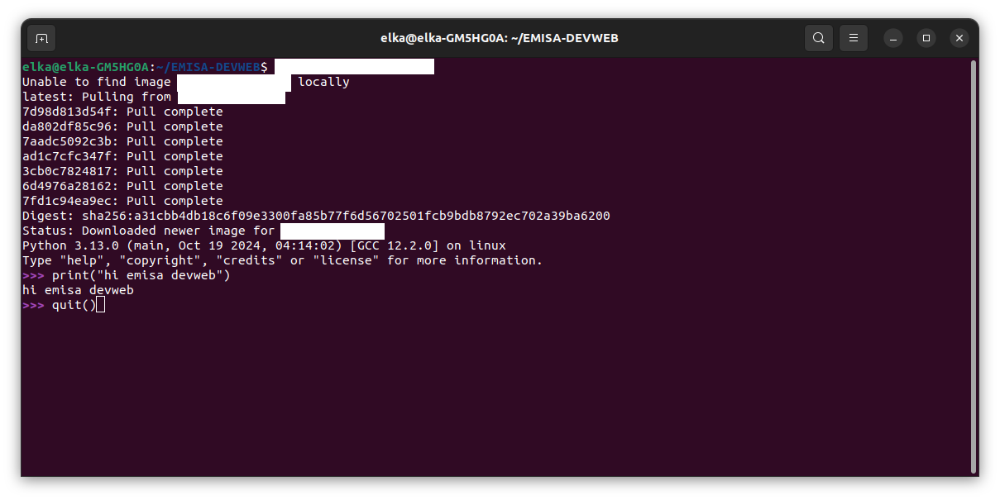
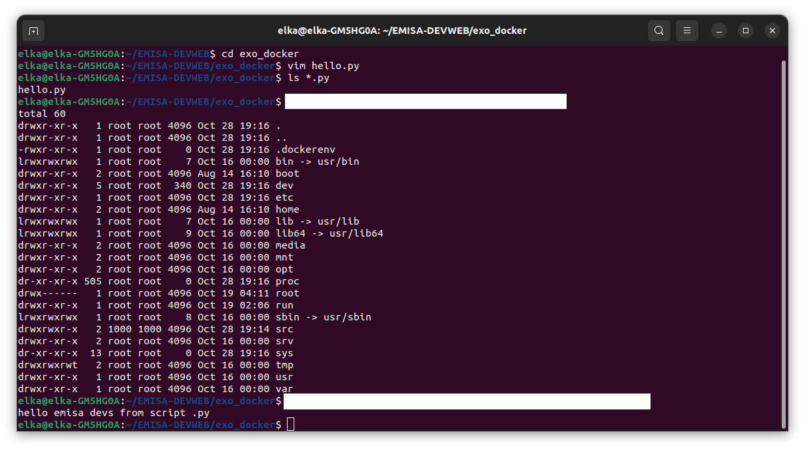
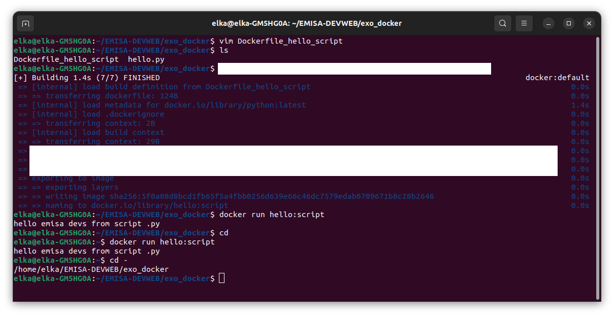
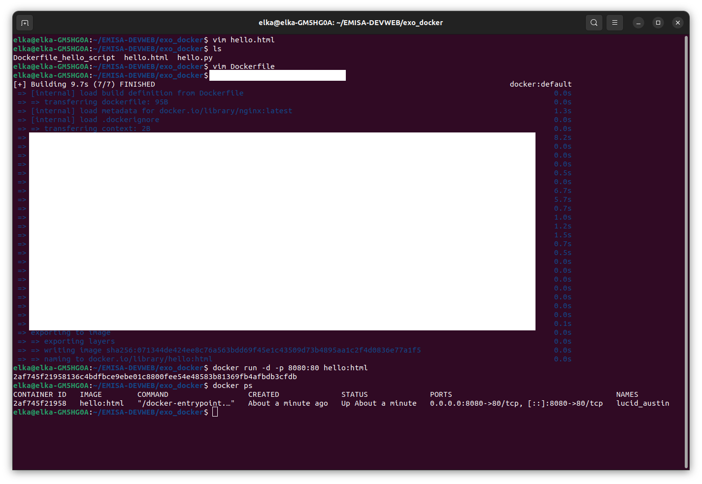

# Exercice 0 : installation et premier conteneur

1. Installer Docker CE en suivant [la doc officielle](https://docs.docker.com/get-docker/) ou autres tutos d'install qui vous plaisent !
> * sur Ubuntu : https://www.digitalocean.com/community/tutorials/how-to-install-and-use-docker-on-ubuntu-22-04  
> * sur Windows : https://www.simplilearn.com/tutorials/docker-tutorial/install-docker-on-windows ou https://www.geeksforgeeks.org/how-to-install-docker-on-macos/
> * sur Mac : https://runnable.com/docker/install-docker-on-macos ou https://www.geeksforgeeks.org/how-to-install-docker-on-macos/

2. Exécuter successivement les commandes `$ docker pull ubuntu:22.04` et `docker run -it ubuntu:22.04` dans votre terminal. Que se passe-t-il ? Ça y est, vous avez lancé votre premier conteneur.

3. Trouver comment faire (dans l'ordre) les opérations suivantes (et faites-le évidemment !):
    * quitter le conteneur
    * lister les conteneurs (actifs et inactifs)
    * supprimer un conteneur
    * lister les images Docker
    * supprimer une image

https://collabnix.com/docker-cheatsheet/


# Exercice 1 : prise en main de Docker et commandes de base

1. Démarrer un container interactif de l'image python 3 et y écrire un `print("hello world")` dans le shell interactive python. Puis quitter le shell interactif python.

    _Note 1 : le côté interactif se fait avec les options "-it"_  
    _Note 2 : Le nom et le tag d'une image python est à chercher sur le Docker HUB_  

    L'output doit ressembler à ça :

    

2. Sur votre OS principal, écrire un fichier hello.py avec un `print("Hello World")` dedans.

    a) Démarrer un container en ajoutant un volume hôte entre votre répertoire courant et le répertoire `/src` sur le container, et avec `ls` vérifier au lancement du container que le répertoire courant a été correctement monté

    b) Même chose que a) mais cette fois en exécutant le script python directement au lancement du container.  

    Vous devez obtenir les sorties suivantes :

    

# Exercice 2 : Création d'une image docker personnalisée

On va créer une image docker personnalisée autonome contenant notre fichier hello.py, permettant ainsi de s'affranchir d'un volume

1. Créer un Dockerfile, avec les instructions `FROM`, `COPY` (ou `ADD`, profitez-en pour regarder la différence) et `CMD`
2. Construire l'image à partir de ce Dockerfile et la nommer `hello`
3. Créer un container à partir de cette image `hello`, sans aucune option particulière.

    

# Exercice 3 : Création d'une image NGINX pour servir du contenu statique

On va faire une image nginx en utilisant un container détaché à durée de vie longue:

1. Ecrire un fichier hello.html avec comme contenu `<h1>Hello, World!</h1>`
2. Créer un fichier Dockerfile (**/!\\ Un seul Dockerfile par dossier /!\\**)
    - héritant de l'image de base "nginx:latest",  
    - y copier le fichier "hello.html" dans le répertoire "/usr/share/nginx/html/"  
3. Constuire cette image
4. Démarrer un nouveau container depuis cette image, en utilisant l'option "détaché" et en utilisant l'option de publication de port.
5. Se connecter à http://localhost:[port_externe]/hello.html

    

    

6. Alternative : sans utiliser de Dockerfile, créer un container détaché avec l'option de publication de port de l'image nginx et en ajoutant un volume hôte entre votre répertoire courant et le répertoire "/usr/share/nginx/html/". Vous devez pouvoir accéder au fichier html maias pas uniquement ! Que se passe-t-il lorsque vous accéder à http://localhost:[port_externe]/hello.py par exemple ?

# Exercice 4 : Création d'une image multi-étapes pour une application Flask

On va créer une petite application Flask en utilisant une image multi-étapes pour optimiser la taille finale de l'image.

1. Créer une petite application Flask qui affiche simplement une chaîne de caractères.
    Pour cela, dans un nouveau répertoire, créez un fichier `app.py` avec le code suivant :
    ```python
    from flask import Flask

    app = Flask(__name__)

    @app.route('/')
    def hello_world():
        return 'Hello EMISA Devs from Flask!'

    if __name__ == '__main__':
        app.run(host='0.0.0.0', port=5000)
    ```
2. Construire un Dockerfile simple en une seule étape à partir de l'image `python:3.12` puis construire, exécuter et tester l'application Flask dans un conteneur (en visitant [http://localhost:5000](http://localhost:5000)).  
    _Indications_ :
    ```docker
    FROM python:3.12
    WORKDIR ********* # définition du répertoire de travail
    COPY ********* # copie du fichier app.py dans le dossier
    RUN ********* # installation de flask avec pip
    
    EXPOSE ********* # ouverture du port externe du conteneur
    CMD ********* # commande pour démarrer l'application
    ```
    
3. Construire un Dockerfile multi-étapes pour optimiser la taille de l'image finale. Exécuter et tester l'application Flask.  
    _Indications_ :
    - la première étape installe les dépendances, utiliser pour cette étape l'image `python:3.12`
    - la seconde étape utilise une image allégée pour l'exécution de l'application, utiliser pour cette étape l'image `python:3.12-alpine`
    ```docker
    # Étape 1 - Construction de l'image pour installer les dépendances
    FROM python:3.12 AS build
    WORKDIR ********* # définition du répertoire de travail
    COPY ********* # copie du fichier app.py dans le dossier
    RUN ********* # installation de flask avec pip

    # Étape 2 - Construction de l'image finale
    FROM python:3.12-alpine
    WORKDIR *********
    COPY --from=build ********* # copie de l'app depuis l'image de l'étape 1
    COPY --from=build ********* # copie des dépendances depuis l'image de l'étape 1

    EXPOSE ********* # ouverture du port pour l'accès à l'appli Flask
    CMD ********* # commande pour démarrer l'application
    ```

4. Enfin, comparer les tailles des différentes images ainsi obtenues.